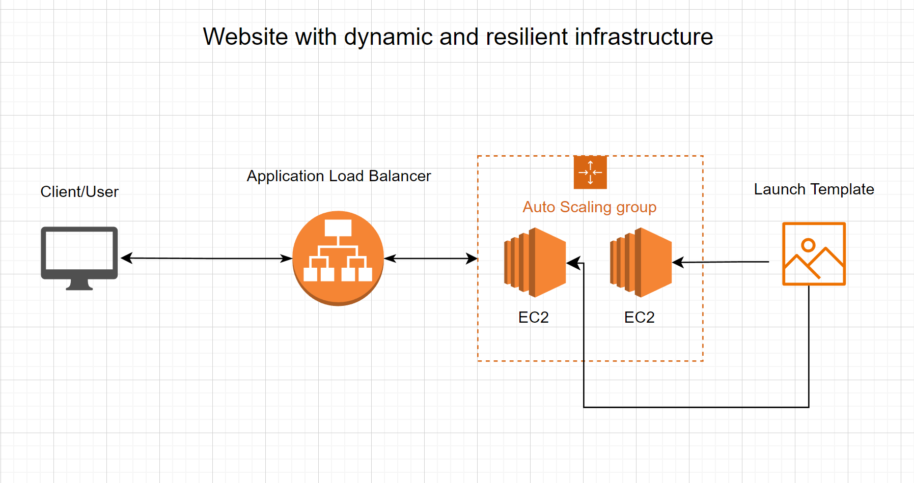

### Hosting environment for a web application, one click solution.
In this guide i'll demononstrade how you can set up a
resilient and scalable solution for hosting a website using cloudformation

###### Things we need.
1. The EC2 instances themselfs
    * Launch template
    * Startup script, although not required as we could 
     use another AMI but we're gonna configure a proof of  
     concept using a script to configure a simple Nginx server.
1. Network configuration
    * Subnet
    * VPC
    * Gateway
    * Route table
    * Route subnets to route table
    * Route gateway to route table
    * Security group
1. An application load balancer
    * Target group
    * Listener
1. Auto scaling group
    * Dynamic scale policy
#### We're gonna configure this with ~~the webui~~ infrastructure as code. More precisely using CloudFormation. 
###### I don't have any parameters section.. so changing stuff is gonna be painful.  
But here we go none the less.  
So we're starting off with the launch template itself. It's fairly straight forward: 
```yaml
AWSTemplateFormatVersion: "2010-09-09"
Resources:
#Launch template
  myLaunchTemplate:
    Type: AWS::EC2::LaunchTemplate
    Properties:
      LaunchTemplateName:
        Fn::Sub: '${AWS::StackName}-template'
      LaunchTemplateData:
        ImageId: 'ami-0b9fd8b55a6e3c9d5'
        InstanceType: "t2.micro"
        SecurityGroupIds:
          - !Ref mySecurityGroup
        KeyName: labb1
```
Then we can add the script i mentioned earlier. So the whole launch template would look something like this:
```yaml
AWSTemplateFormatVersion: "2010-09-09"
Resources:
#Launch template
  myLaunchTemplate:
    Type: AWS::EC2::LaunchTemplate
    Properties:
      LaunchTemplateName:
        Fn::Sub: '${AWS::StackName}-template'
      LaunchTemplateData:
        ImageId: 'ami-0b9fd8b55a6e3c9d5'
        InstanceType: "t2.micro"
        SecurityGroupIds:
          - !Ref mySecurityGroup
        KeyName: labb1
#Script below will ping untill it gets an answer (Aka check for network connectivity)
#Then it'll update dnf, install nginx, start the deamon and enable it
#Lastly it'll replace the word "If" in the nginx html file to a cheksum of time. 
#The last line will let you see if the loadbalancer works by having a unique website for each EC2 instance.
        UserData: 
          Fn::Base64: !Sub |
            #!/bin/bash
            while ! ping -c 1 -n -w 1 8.8.8.8 &> /dev/null; do
              sleep 1
            done
            dnf update -y && dnf install nginx -y
            systemctl start nginx.service && systemctl enable nginx.service
            sed -i -e "s/If/$(date|md5sum)/g" /usr/share/nginx/html/index.html
#The lines below i've used to make sure the autoscaling works by ripping the cpu at 100% on all instances it creates. Good for diagnostics.
#            dnf install htop -y && dnf install stress -y         
#            stress -c 1
```
Note that we're naming our resources partly or fully like our stack name as shown below.
This will make sure we don't have any name crashes. Atleast it's ***highly*** unlikely.
```yaml
      LaunchTemplateName:
        Fn::Sub: '${AWS::StackName}-template'
```
Next up we'll create our own VPC. This is to make sure we have full control  
of what's happening, and decreasing any malfunction risk due to other entities  
in our VPC.
If the CidrBlock isn't to you liking you're welcome to change that. 
(Yeah i should've used a parameter section, I know)

```yaml
#Virtual network
  myVPC:
    Type: AWS::EC2::VPC
    Properties: 
      CidrBlock: '10.0.0.0/16'
      Tags: 
        - Key: Name
          Value:
            Fn::Sub: '${AWS::StackName}-myVPC'
      EnableDnsSupport: 'true'
      EnableDnsHostnames: 'true'
```
Creating the Internet Gateway below.
```yaml
#Create Gateway
  myInternetGateway:
    Type: AWS::EC2::InternetGateway
    Properties: 
      Tags: 
        - Key: Name
          Value:
            Fn::Sub: '${AWS::StackName}-InternetGateway'
    DependsOn: myVPC
```
Next up we'll attach the previously created Internet Gateway to the VPC. 
```yaml
#Attaching gateway to virtual network
  myGatewayAttach:
    Type: AWS::EC2::VPCGatewayAttachment
    Properties: 
      InternetGatewayId:
        Ref: myInternetGateway
      VpcId:
        Ref: myVPC
    DependsOn: myInternetGateway
```
We will also need subnets. I opted for 3 subnets in 3 different  
availability zones for the most resilient setup.
```yaml
#Create subnet A
  mySubnetA:
    Type: AWS::EC2::Subnet
    Properties: 
      AvailabilityZone: !Select 
        - 0
        - Fn::GetAZs: !Ref AWS::Region
      VpcId: !Ref myVPC
      CidrBlock: '10.0.1.0/24'
      MapPublicIpOnLaunch: True
#Create subnet B
  mySubnetB:
    Type: AWS::EC2::Subnet
    Properties: 
      AvailabilityZone: !Select
        - 1
        - Fn::GetAZs: !Ref AWS::Region
      VpcId: !Ref myVPC
      CidrBlock: '10.0.2.0/24'
      MapPublicIpOnLaunch: True
#Create subnet C
  mySubnetC:
    Type: AWS::EC2::Subnet
    Properties: 
      AvailabilityZone: !Select 
        - 2
        - Fn::GetAZs: !Ref AWS::Region
      VpcId: !Ref myVPC
      CidrBlock: '10.0.3.0/24'
      MapPublicIpOnLaunch: True
```
Now we have the building blocks of the internet structure down.
Next we need to be able to route trafic from the 3 subnets to the internet gateway.
For that we need something called a Route Table. Subnets will route to the  
Route Table and the Internet Gateway also be routed to the Route Table.

Creating the Route Table:
```yaml
#Create route table
  myRouteTable:
    Type: AWS::EC2::RouteTable
    Properties:
      VpcId:  
        Ref: myVPC
      Tags:
        - Key: Name
          Value:
            Fn::Sub: '${AWS::StackName}'
```
Now we'll route everything together:
```yaml
#Routing network traffic from route table to gateway 
  myRoute:
    Type: AWS::EC2::Route
    Properties:
      GatewayId: !Ref myInternetGateway
      DestinationCidrBlock: 0.0.0.0/0
      RouteTableId: !Ref myRouteTable
#Create route from subnet A to route table
  mySubnetRouteTableAssociationA:
    Type: AWS::EC2::SubnetRouteTableAssociation
    Properties:
      SubnetId:
        Ref: mySubnetA
      RouteTableId:
        Ref: myRouteTable
#Create route from subnet B to route table
  mySubnetRouteTableAssociationB:
    Type: AWS::EC2::SubnetRouteTableAssociation
    Properties:
      SubnetId:
        Ref: mySubnetB
      RouteTableId:
        Ref: myRouteTable
#Create route from subnet C to route table
  mySubnetRouteTableAssociationC:
    Type: AWS::EC2::SubnetRouteTableAssociation
    Properties:
      SubnetId:
        Ref: mySubnetC
      RouteTableId:
        Ref: myRouteTable
```
Lastly on the network part of this guide, the security group.
We're gonna create a security group with 3 ingress rules and 0 egress rules:
```yaml
#Create security group with no egress rules, but ingress on HTTP, HTTPS and SSH.
  mySecurityGroup:
    Type: AWS::EC2::SecurityGroup
    Properties: 
      GroupDescription: "SecGroup for ASG"
      GroupName:
        Fn::Sub: '${AWS::StackName}-mySecurityGroup'
      SecurityGroupIngress: 
        - IpProtocol: tcp
          FromPort: 80
          ToPort: 80
          CidrIp: 0.0.0.0/0
        - IpProtocol: tcp
          FromPort: 443
          ToPort: 443
          CidrIp: 0.0.0.0/0
        - IpProtocol: tcp
          FromPort: 22
          ToPort: 22
          CidrIp: 0.0.0.0/0
      Tags: 
        - Key: Name
          Value:
            Fn::Sub: '${AWS::StackName}-HTTP-HTTPS-SSH'
      VpcId: !Ref myVPC
```

Let's bring up a checklist to see what we've done so far.
- [x] 1. The EC2 instances themselfs
    - [x]  Launch template
    - [x] Startup script, although not required as we could 
      use another AMI but we're gonna configure a proof of  
      concept using a script to configure a simple Nginx server.
- [x] 2. Network configuration
    - [x] Subnet
    - [x] VPC
    - [x] Gateway
    - [x] Route table
    - [x] Route subnets to route table
    - [x] Route gateway to route table
    - [x] Security group
- [ ] 3. An application load balancer
    - [ ] Target group
    - [ ] Listener
- [ ] 4. Auto scaling group
    - [ ] Dynamic scale policy


Alright, now for the fun part. A brief explanation of how the next steps come together.
Application load balancer, Target group, listener and Auto scaling group:

#### How They Work Together:


1. ###### Request is received:
    * A request comes into the Application Load Balancer (ALB).
2. ###### ALB's Listener and Target Group: 
    * The ALB uses its configured listener to determine which target group to send the request to. 
    * This decision is based on the content or protocol of the request.
3. ###### Target Group Chooses Targets:
    * The target group uses its own rules to select the appropriate targets (e.g., EC2 instances) to handle the request.
4. ###### Forwarding to Targets:
    * The ALB forwards the request to the selected targets within the target group.
5. ###### Auto Scaling Group's Role:
    * If the target group is associated with an Auto Scaling Group, it ensures that the right number of instances are available to handle the incoming traffic.  
------
With that out of the way, onwards to application load balancer:
```yaml
#Create application load balancer
  myLoadBalancer:
    Type: AWS::ElasticLoadBalancingV2::LoadBalancer
    Properties:
      Name: 
        Fn::Sub: '${AWS::StackName}-template'
      SecurityGroups:
        - !Ref mySecurityGroup
      Type: application
      Subnets: 
        - !Ref mySubnetA
        - !Ref mySubnetB
        - !Ref mySubnetC
    DependsOn: myGatewayAttach
```
Then we got the target group:
```yaml
#Create target group
  myTargetGroup:
    Type: AWS::ElasticLoadBalancingV2::TargetGroup
    Properties:
      HealthCheckEnabled: True
      Name:
        Fn::Sub: '${AWS::StackName}-template'
      Port: 80
      Protocol: HTTP
      VpcId: !Ref myVPC
```
The Listener:
```yaml
#Create listener
  myListener:
    Type: AWS::ElasticLoadBalancingV2::Listener
    Properties:
      DefaultActions:
        - Type: "forward"
          TargetGroupArn: !Ref myTargetGroup
      LoadBalancerArn: !Ref myLoadBalancer
      Port: 80
      Protocol: "HTTP"
```
Autoscale group:
```yaml
#Create auto scaling group
  myAutoScalingGroup:
    Type: AWS::AutoScaling::AutoScalingGroup
    Properties:
      TargetGroupARNs: 
        - !Ref myTargetGroup
      LaunchTemplate:
        LaunchTemplateId: !Ref myLaunchTemplate
        Version: !GetAtt myLaunchTemplate.LatestVersionNumber
      MaxSize: '5'
      MinSize: '1'
      DesiredCapacity: '1'
      VPCZoneIdentifier:
       - !Ref mySubnetA
       - !Ref mySubnetB
       - !Ref mySubnetC
    DependsOn: myGatewayAttach
```
This Autoscale group would be fairly useless without telling it  
when it should create new machines.  
I opted for a cpu load based determination.
Basically: If avarage CPU load split among the  
Autoscale group exceeds 70%,
create more instances.
```yaml
#Create automatic/dynamic scaling policy. In this case we'll scale up if cpu usage goes over 70% spread between all instances.
  myCPUPolicy:
    Type: AWS::AutoScaling::ScalingPolicy
    Properties:
      AutoScalingGroupName: !Ref myAutoScalingGroup
      PolicyType: TargetTrackingScaling
      TargetTrackingConfiguration:
        PredefinedMetricSpecification:
          PredefinedMetricType: ASGAverageCPUUtilization
        TargetValue: "70"
``` 
Lastly we have our outputs. I'll leave in some comments for outputs  
I used when I was trying to diagnose the stack.
```yaml
#myLoadBalancerURL will be the url you'll use to access the Nginx website.
#The rest have been somewhat useful for diagnostics
Outputs:
  myLoadBalancerURL:
    Description: "The URL of the Load Balancer"
    Value: !GetAtt myLoadBalancer.DNSName
#  SubnetAId:
#    Description: Subnet A ID
#    Value: !Ref mySubnetA
#  SubnetBId:
#    Description: Subnet B ID
#    Value: !Ref mySubnetB
#  SubnetCId:
#    Description: Subnet C ID
#    Value: !Ref mySubnetC
#  VpcId:
#    Description: myVPC ID
#    Value: !Ref myVPC
#  myRouteTable:
#    Description: "ID of myRouteTable"
#    Value: !Ref myRouteTable
``` 
That's it. If you followed along our checklist should looks somewhat like this:
- [x] 1. The EC2 instances themselfs
    - [x]  Launch template
    - [x] Startup script, although not required as we could 
      use another AMI but we're gonna configure a proof of  
      concept using a script to configure a simple Nginx server.
- [x] 2. Network configuration
    - [x] Subnet
    - [x] VPC
    - [x] Gateway
    - [x] Route table
    - [x] Route subnets to route table
    - [x] Route gateway to route table
    - [x] Security group
- [x] 3. An application load balancer
    - [x] Target group
    - [x] Listener
- [x] 4. Auto scaling group
    - [x] Dynamic scale policy

__Made by__ ___Felix Pettersson.___  
__MOV2022 Campus Mölndal__

(Entire script down below for ease of use)

```yaml
AWSTemplateFormatVersion: "2010-09-09"
Resources:
#Launch template
  myLaunchTemplate:
    Type: AWS::EC2::LaunchTemplate
    Properties:
      LaunchTemplateName:
        Fn::Sub: '${AWS::StackName}-template'
      LaunchTemplateData:
        ImageId: 'ami-0b9fd8b55a6e3c9d5'
        InstanceType: "t2.micro"
        SecurityGroupIds:
          - !Ref mySecurityGroup
        KeyName: labb1
#Script below will ping untill it gets an answer (Aka check for network connectivity)
#Then it'll update dnf, install nginx, start the deamon and enable it
#Lastly it'll replace the word "If" in the nginx html file to a cheksum of time. 
#The last line will let you see if the loadbalancer works by having a unique website for each EC2 instance.
        UserData: 
          Fn::Base64: !Sub |
            #!/bin/bash
            while ! ping -c 1 -n -w 1 8.8.8.8 &> /dev/null; do
              sleep 1
            done
            dnf update -y && dnf install nginx -y
            systemctl start nginx.service && systemctl enable nginx.service
            sed -i -e "s/If/$(date|md5sum)/g" /usr/share/nginx/html/index.html
#The lines below i've used to make sure the autoscaling works by ripping the cpu at 100% on all instances it creates. Good for diagnostics.
#            dnf install htop -y && dnf install stress -y         
#            stress -c 1
#Virtual network
  myVPC:
    Type: AWS::EC2::VPC
    Properties: 
      CidrBlock: '10.0.0.0/16'
      Tags: 
        - Key: Name
          Value:
            Fn::Sub: '${AWS::StackName}-myVPC'
      EnableDnsSupport: 'true'
      EnableDnsHostnames: 'true'
#Create Gateway
  myInternetGateway:
    Type: AWS::EC2::InternetGateway
    Properties: 
      Tags: 
        - Key: Name
          Value:
            Fn::Sub: '${AWS::StackName}-InternetGateway'
    DependsOn: myVPC
#Attaching gateway to virtual network
  myGatewayAttach:
    Type: AWS::EC2::VPCGatewayAttachment
    Properties: 
      InternetGatewayId:
        Ref: myInternetGateway
      VpcId:
        Ref: myVPC
    DependsOn: myInternetGateway
#Create subnet A
  mySubnetA:
    Type: AWS::EC2::Subnet
    Properties: 
      AvailabilityZone: !Select 
        - 0
        - Fn::GetAZs: !Ref AWS::Region
      VpcId: !Ref myVPC
      CidrBlock: '10.0.1.0/24'
      MapPublicIpOnLaunch: True
#Create subnet B
  mySubnetB:
    Type: AWS::EC2::Subnet
    Properties: 
      AvailabilityZone: !Select
        - 1
        - Fn::GetAZs: !Ref AWS::Region
      VpcId: !Ref myVPC
      CidrBlock: '10.0.2.0/24'
      MapPublicIpOnLaunch: True
#Create subnet C
  mySubnetC:
    Type: AWS::EC2::Subnet
    Properties: 
      AvailabilityZone: !Select 
        - 2
        - Fn::GetAZs: !Ref AWS::Region
      VpcId: !Ref myVPC
      CidrBlock: '10.0.3.0/24'
      MapPublicIpOnLaunch: True
#Create route table
  myRouteTable:
    Type: AWS::EC2::RouteTable
    Properties:
      VpcId:  
        Ref: myVPC
      Tags:
        - Key: Name
          Value:
            Fn::Sub: '${AWS::StackName}'
#Routing network traffic from route table to gateway 
  myRoute:
    Type: AWS::EC2::Route
    Properties:
      GatewayId: !Ref myInternetGateway
      DestinationCidrBlock: 0.0.0.0/0
      RouteTableId: !Ref myRouteTable
#Create route from subnet A to route table
  mySubnetRouteTableAssociationA:
    Type: AWS::EC2::SubnetRouteTableAssociation
    Properties:
      SubnetId:
        Ref: mySubnetA
      RouteTableId:
        Ref: myRouteTable
#Create route from subnet B to route table
  mySubnetRouteTableAssociationB:
    Type: AWS::EC2::SubnetRouteTableAssociation
    Properties:
      SubnetId:
        Ref: mySubnetB
      RouteTableId:
        Ref: myRouteTable
#Create route from subnet C to route table
  mySubnetRouteTableAssociationC:
    Type: AWS::EC2::SubnetRouteTableAssociation
    Properties:
      SubnetId:
        Ref: mySubnetC
      RouteTableId:
        Ref: myRouteTable
#Create security group with no egress rules, but ingress on HTTP, HTTPS and SSH.
  mySecurityGroup:
    Type: AWS::EC2::SecurityGroup
    Properties: 
      GroupDescription: "SecGroup for ASG"
      GroupName:
        Fn::Sub: '${AWS::StackName}-mySecurityGroup'
      SecurityGroupIngress: 
        - IpProtocol: tcp
          FromPort: 80
          ToPort: 80
          CidrIp: 0.0.0.0/0
        - IpProtocol: tcp
          FromPort: 443
          ToPort: 443
          CidrIp: 0.0.0.0/0
        - IpProtocol: tcp
          FromPort: 22
          ToPort: 22
          CidrIp: 0.0.0.0/0
      Tags: 
        - Key: Name
          Value:
            Fn::Sub: '${AWS::StackName}-HTTP-HTTPS-SSH'
      VpcId: !Ref myVPC
#Create application load balancer
  myLoadBalancer:
    Type: AWS::ElasticLoadBalancingV2::LoadBalancer
    Properties:
      Name: 
        Fn::Sub: '${AWS::StackName}-template'
      SecurityGroups:
        - !Ref mySecurityGroup
      Type: application
      Subnets: 
        - !Ref mySubnetA
        - !Ref mySubnetB
        - !Ref mySubnetC
    DependsOn: myGatewayAttach
#Create target group
  myTargetGroup:
    Type: AWS::ElasticLoadBalancingV2::TargetGroup
    Properties:
      HealthCheckEnabled: True
      Name:
        Fn::Sub: '${AWS::StackName}-template'
      Port: 80
      Protocol: HTTP
      VpcId: !Ref myVPC
#Create listener
  myListener:
    Type: AWS::ElasticLoadBalancingV2::Listener
    Properties:
      DefaultActions:
        - Type: "forward"
          TargetGroupArn: !Ref myTargetGroup
      LoadBalancerArn: !Ref myLoadBalancer
      Port: 80
      Protocol: "HTTP"
#Create auto scaling group
  myAutoScalingGroup:
    Type: AWS::AutoScaling::AutoScalingGroup
    Properties:
      TargetGroupARNs: 
        - !Ref myTargetGroup
      LaunchTemplate:
        LaunchTemplateId: !Ref myLaunchTemplate
        Version: !GetAtt myLaunchTemplate.LatestVersionNumber
      MaxSize: '5'
      MinSize: '1'
      DesiredCapacity: '1'
      VPCZoneIdentifier:
       - !Ref mySubnetA
       - !Ref mySubnetB
       - !Ref mySubnetC
    DependsOn: myGatewayAttach
#Create automatic/dynamic scaling policy. In this case we'll scale up if cpu usage goes over 70% spread between all instances.
  myCPUPolicy:
    Type: AWS::AutoScaling::ScalingPolicy
    Properties:
      AutoScalingGroupName: !Ref myAutoScalingGroup
      PolicyType: TargetTrackingScaling
      TargetTrackingConfiguration:
        PredefinedMetricSpecification:
          PredefinedMetricType: ASGAverageCPUUtilization
        TargetValue: "70"
#myLoadBalancerURL will be the url you'll use to access the Nginx website.
#The rest have been somewhat useful for diagnostics
Outputs:
  myLoadBalancerURL:
    Description: "The URL of the Load Balancer"
    Value: !GetAtt myLoadBalancer.DNSName
#  SubnetAId:
#    Description: Subnet A ID
#    Value: !Ref mySubnetA
#  SubnetBId:
#    Description: Subnet B ID
#    Value: !Ref mySubnetB
#  SubnetCId:
#    Description: Subnet C ID
#    Value: !Ref mySubnetC
#  VpcId:
#    Description: myVPC ID
#    Value: !Ref myVPC
#  myRouteTable:
#    Description: "ID of myRouteTable"
#    Value: !Ref myRouteTable
```


