# Deploy a webapplication on 2 loadbalanced ec2 instances using Code-Pipeline.
###### I neglected this for far too long so no chaotic IAC this time.
---
Let's start with a plan

1. 2 EC2 instances
    * IAM role configuration then apply it
    * Startup scrip
2. Application Load Balancer
    * Target group
    * Listeners
3. CodeCommit
    * Setup a repo
    * Clone the repo locally (I'm using VSCode)
    * Make sure we can push to repo
    * Build our SimpleWebsite App and push it
4. CodeDeploy
    * Create a CodeDeploy service role (IAM)
    * Create our application in CodeDeploy
    * Create a deployment group in CodeDeploy
5. CodePipeline
    * Create a pipeline in CodePipeline
        * *Optional*
            * Pray to god everything works
    * Verify our pipeline
---
The plan actually looks surprisingly good, let's try it out.

##### Creating the instance role (IAM)
1. Go to the IAM in the web ui (Or click this link) https://console.aws.amazon.com/iam/).
2. Go to **Roles**
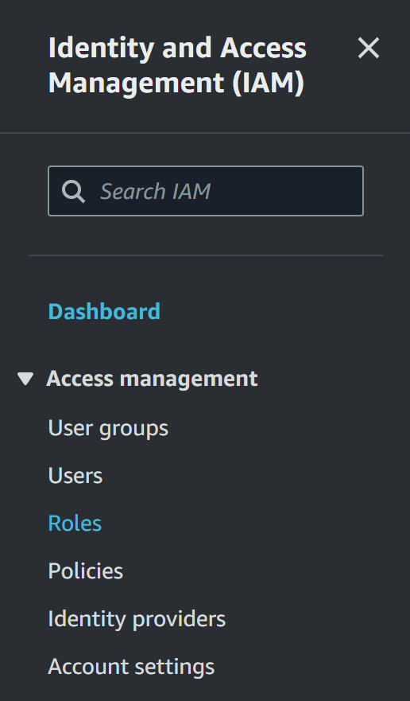
###### Jesus, that was big
3. look for this gem
 (top right corner)
4. Under **Select type of trusted entity**, select **AWS service**. Under **Choose a use case**, select **EC2**. Under **Select your use case**, choose **EC2**. Choose **Next: Permissions**.
5. Search for and select the policy named **AmazonEC2RoleforAWSCodeDeploy**
6. Search for and select the policy named **AmazonSSMManagedInstanceCore**. Choose **Next: Tags.**
7. Choose **Next: Review**. Enter a name for the role (for example, **AmazonEC2RoleforAWSCodeDeploy**).
8. **Create Role**
###### Yes alot of this is stolen from an amazon guide. What can I say, they make good guides.
---
Let's launch som instances
1. Make sure you name them, and **name them identically**. We'll use the name later
2. I'll name them **MyWebsite**
3. Since we're using a loadbalancer, we'll create **2**.
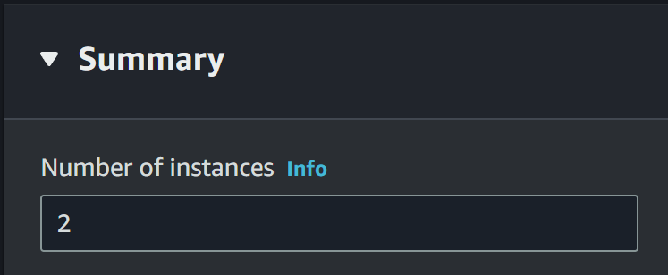
4. SEC groups; **HTTPS, HTTP, SSH**
5. Under **Advanced details** and **IAM instance profile** select the role you previously created
6. One last thing to add under **User data**
```bash
#!/bin/bash
dnf update -y && dnf install nginx -y
systemctl start nginx.service
systemctl enable nginx.service
```
6. **Launch instance**
##### My EC2 instances look like this
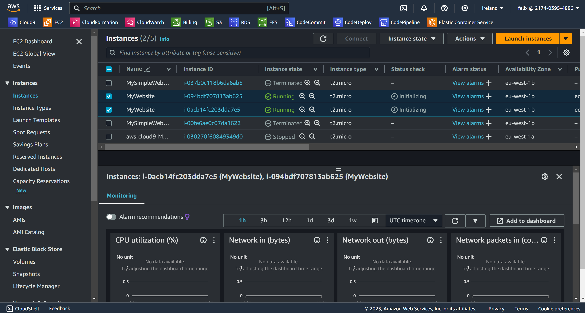
###### Worried about the User Data? Cause we don't have a CodeDeploy agent?  
###### *Relax*
--- 
##### The Application Load Balancer *(And the target group)*.
1. In the navigation pane, under **Load Balancing**, choose **Target Groups**.
2. **Create target group**
3. In **Specify group details** select **Instances** as shown below
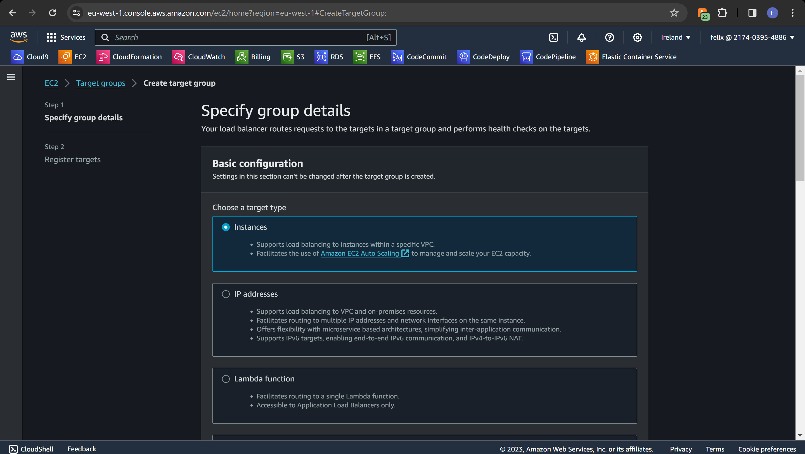
4. Enter a name in **Target group name**. I'm naming mine "MyWebsite" 
5. Scroll down, press **Next**
6. **Registered targets**. Make sure you select both, as shown below.
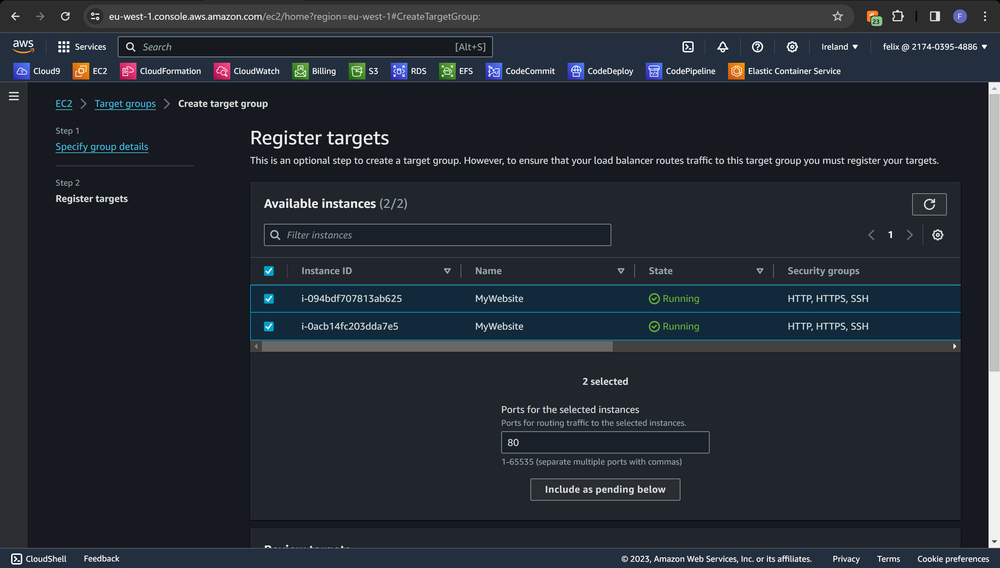
7. Press **Include as pending below**
8. Scroll down, press **Create target group**
#### It should look like this
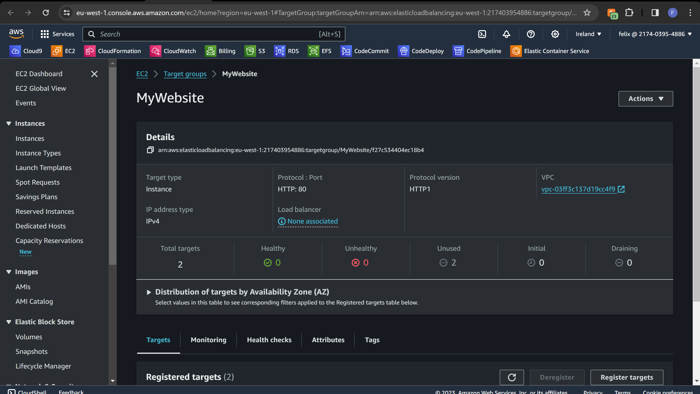
Sidenote, I do kind of wish I kept using CloudFormation..
But my ambition for my side project got the better of me.
Anyway, TO THE APPLICATION LOAD BALANCER!

---
##### To create an Application Load Balancer
1. In the EC2 dashboard, scroll down, select **Load Balancers**
2. Press **Create load balancer**
3. Press create under **Application Load Balancer**
4. Load balancer name, I chose MyWebsite. *(Shocker, right?)*
5. **Mapping**. I just enabled them all
6. In **Security groups** add **HTTP**
7. In **Listeners and routing** Select the **target group** you previously made.
8. And **Create load balancer**
Should look a little something like this:
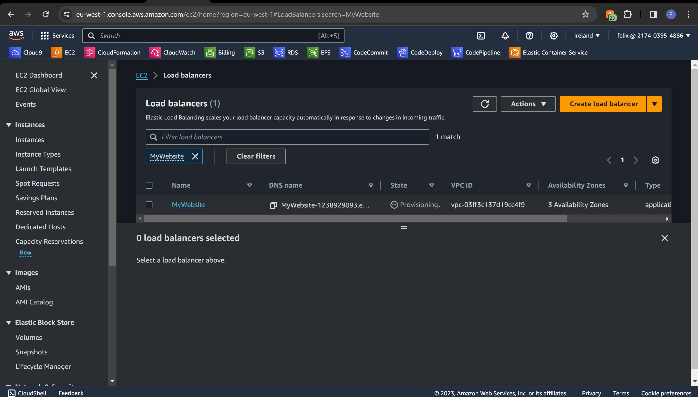
Once it's up and running copy the **DNS name** and try accessing it in your browser.
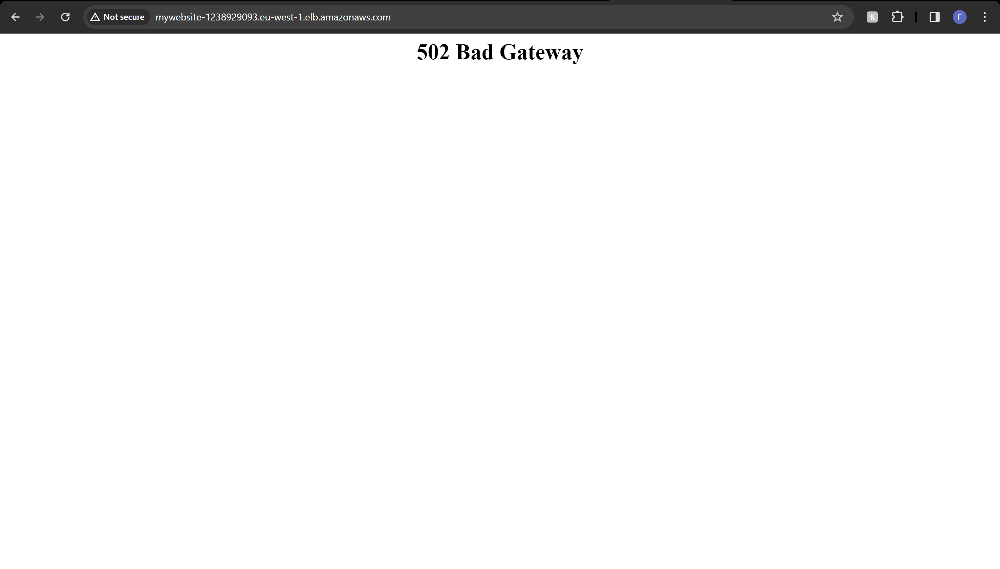
Hold up..
Oooh. I actually forgot to enter the User Data. 
Should've used *Infrastructure as code*
ANYWAY once we fixed that, we should be up and running
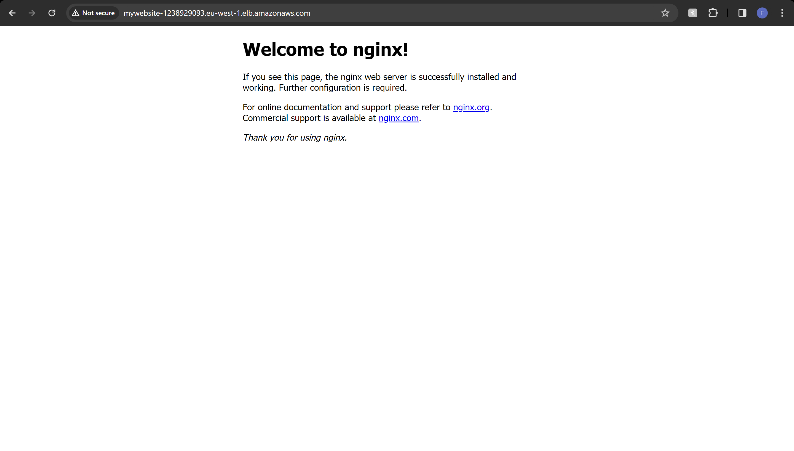
Perfect.
---

##### CodeCommit repo.
1. Navigate to **CodeCommit**
2. On the **Repositories** page, choose **Create repository**
3. On the **Create repository** page, in **Repository name**, 
 enter a name for your repository (For me, once again, MyWebsite).
4. Choose **Create**
The upcoming steps are for VSCode. Some requisites are required,  
git, for example. I will not show you how to install git locally.
If you really don't want to use git to push you could actually manually  
input the files in your repo but I'd setup git.
5. Create a ReadMe.md file in your repo. (Easier to see a successfull clone)
6. Copy the **Copy HTTPS*
7. Clone your repo to your VSCode using the following  
command: git clone https://git-codecommit.eu-west-1.amazonaws.com/v1/repos/MySimpleWebsite.  
(If it isn't obvious, replace the url with your own.)
8. locally, you'll need MyWebsite app. Looks like this.
 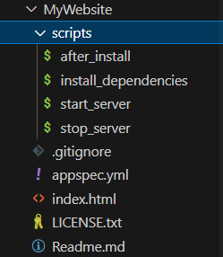
This will be available on my github. 
9. Now you can push it up to your repo. Or just manually put it there.  
It would look kind of like this. But yours is gonna be called "MyWebsite", 
 potato potato. wow that really doesn't work on text.  
 anyway, that's your CodeDommit repo done
---

#### To create a CodeDeploy service role

1. Access the IAM console by navigating to https://console.aws.amazon.com/iam/.
2. Once you're on the console's main dashboard, select **Roles**.
3. Click on **Create role**.
4. In the **Select trusted entity** section, pick **AWS service**. For the **Use case**, select **CodeDeploy**. 
Then, from the available options, choose **CodeDeploy** again. Click **Next**. Note that the **AWSCodeDeployRole**  
managed policy will already be associated with the role.
5. Proceed by clicking **Next**.
6. Assign a unique name to your role (for instance, **CodeDeployRole**), 
 and finalize the process by selecting **Create role**.

 #### To create an application in CodeDeploy
1. Access the CodeDeploy console at https://console.aws.amazon.com/codedeploy.
2. If the Applications page is not displayed immediately, navigate using the menu to **Applications**.
3. Click **Create application**.
4. In the **Application name** field, select a name. (Yeah, i used MyWebsite again.)
5. For **Compute Platform**, select **EC2/On-premises**.
6. To complete the process, click **Create application**.

#### To set up a deployment group in CodeDeploy:

 A deployment group is an entity that specifies deployment settings  
 such as target instances and the deployment pace.  

1. On the page that displays your application, click **Create deployment group**.
2. For **Deployment group name**, Choose a name. (Yes, MyWebsite)
3. In **Service role**, select the service role you created previously (e.g., **CodeDeployRole**).
4. Under **Deployment type**, opt for **In-place**.
5. Within **Environment configuration**, select **Amazon EC2 Instances**. For the Key field, input **Name**.  
In the Value field, input the tag name of your instance (e.g., **MyWebsite**).
6. In **Agent configuration with AWS Systems Manager**, pick **Now and schedule updates**. This action will install the agent on your instance. Note that the Linux instance should already have the SSM agent and 
 will be updated with the CodeDeploy agent through this step.
7. For **Deployment configuration**, choose **CodeDeployDefault.OneAtaTime**.
8. Under **Load Balancer**, ensure that **Enable load balancing** is deselected. This seems strange.  
It is strange and probably not the way you'd hope I would do this. No, our Loadbalancer isn't gonna  
redirect traffic from an EC2 that's under deployment. I didn't put any time into this simply because  
I wanna jump into my "Side project" I mentioned earlier. Sorry about that.
9. To finalize, click **Create deployment group**.
 ---

#### To create a CodePipeline pipeline


1. Access the CodePipeline console at https://console.aws.amazon.com/codepipeline/.

2. Click **Create pipeline**.

3. In **Step 1: Choose pipeline settings**, for **Pipeline name**, "**MyWebsite**".

4. For **Service role**, opt for **New service role** to authorize CodePipeline to generate a service role in IAM.

5. Keep the default settings in **Advanced settings** and then select **Next**.

6. In **Step 2: Add source stage**, for **Source provider**, pick **CodeCommit**. For **Repository name**, select the CodeCommit repository you established. For **Branch name**, choose **main**, then proceed with **Next step**.

7. Under **Change detection options**, choose . This configures CodePipeline to  
utilize Amazon CloudWatch Events for detecting alterations in your source repository.

8. Press **Next**.

9. In **Step 3: Add build stage**, select **Skip build stage**, confirm the action by choosing **Skip** again,  
 then click **Next**.

10. For **Step 4: Add deploy stage**, within **Deploy provider**, select **CodeDeploy**. In **Application name**,  
 pick **MyDemoApplication**. For **Deployment group**, choose **MyDemoDeploymentGroup**,   
 and continue with **Next step**.

11. At **Step 5: Review**, verify the details, and then finalize by clicking **Create pipeline**.


For me, it triggered the pipeline to run directly after pressing **create pipeline**

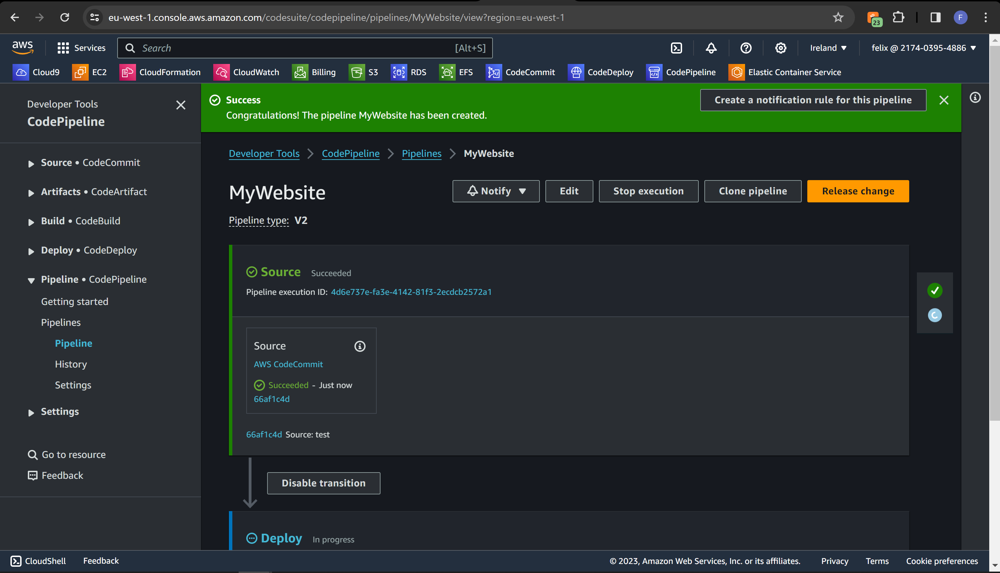

Aaaaaaand it failed. fear not, i forgot to add the IAM role.  
If you did successfully follow my guide (which i didn't..)  
It should look something like this.
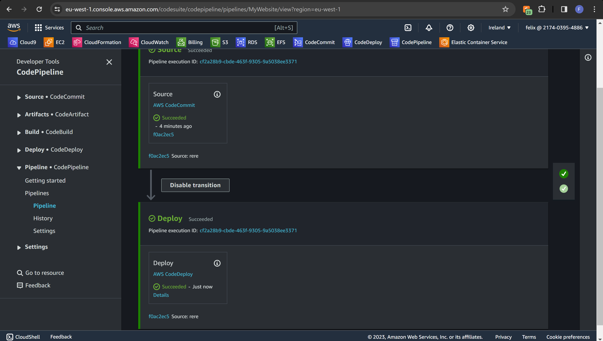
and now if we browse on the DNS of the Loadbalancer:
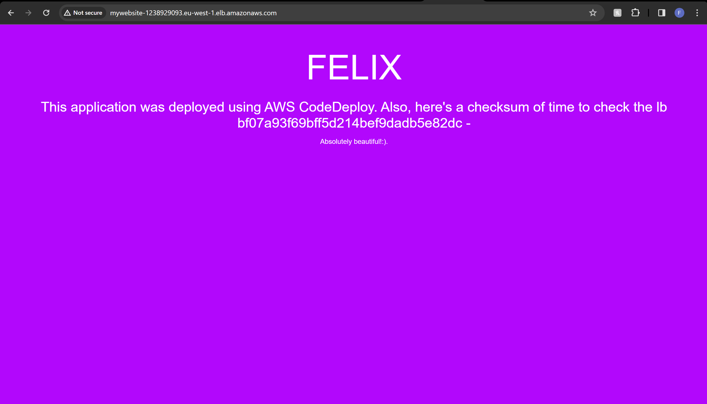
if we reload
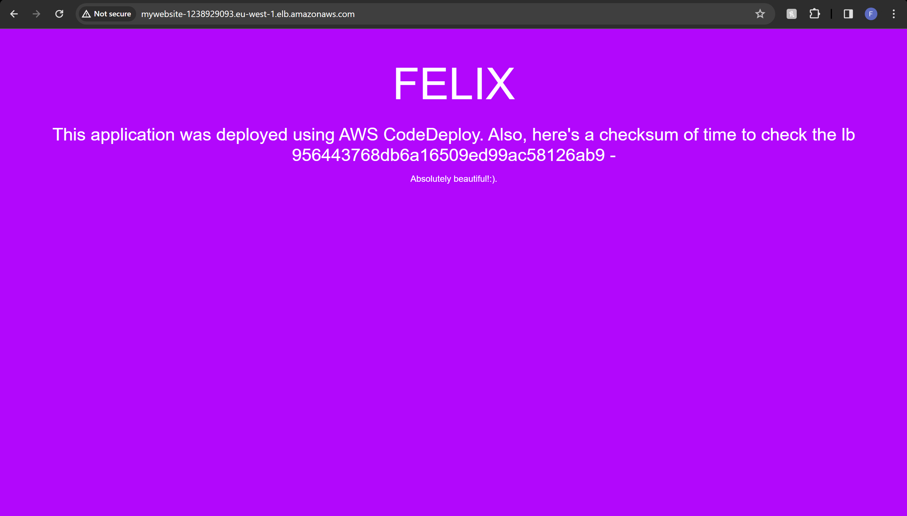
Those weird numbers and letters are a way to set identical data with the script we implemented.  
All done  
  
    
      
        
Chaotic guide by Felix Pettersson, MOV22.
  
  Note, after repeted human errors, I do now see  
  how IAC really can be useful. Like, very useful.  
  