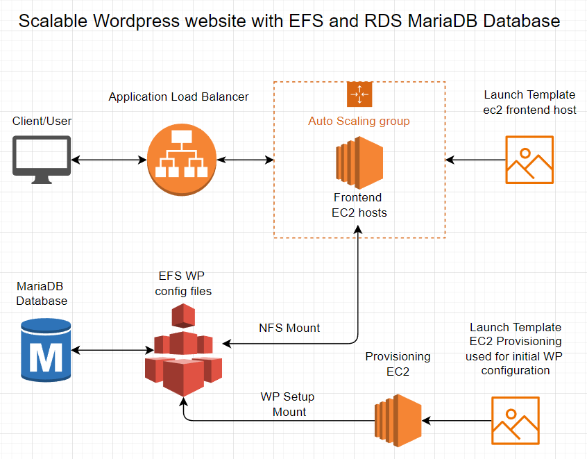
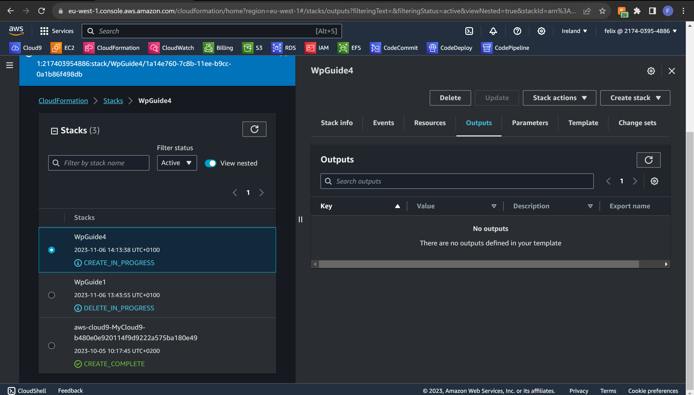
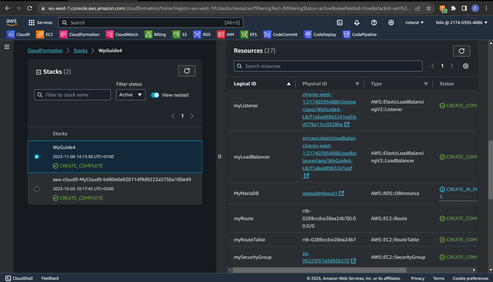
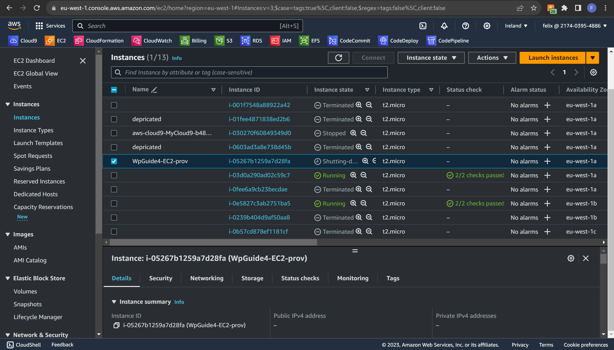
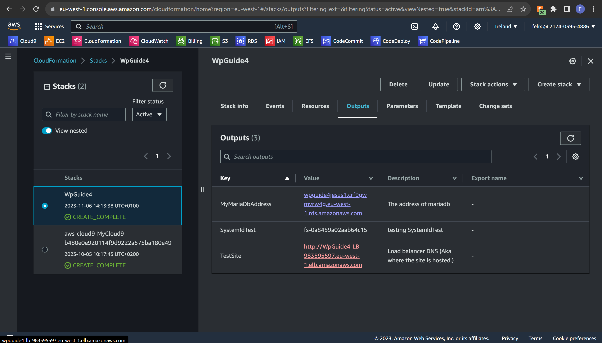
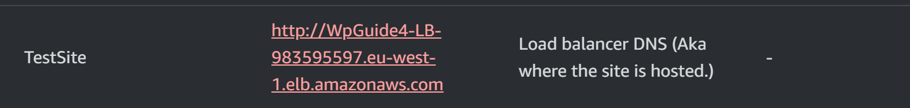
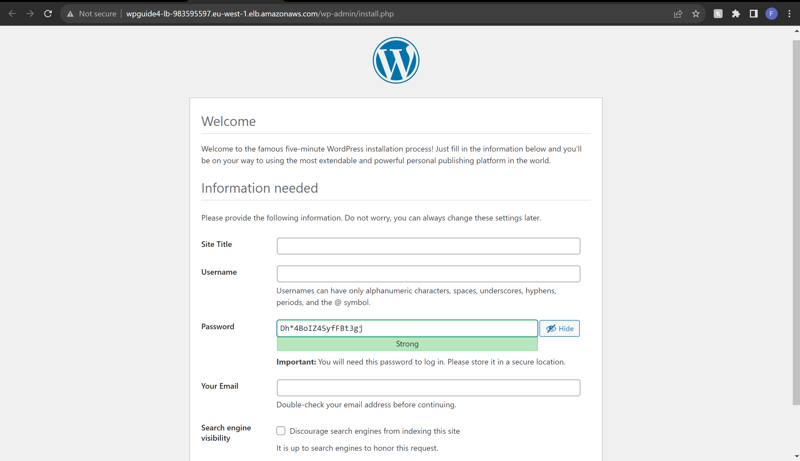
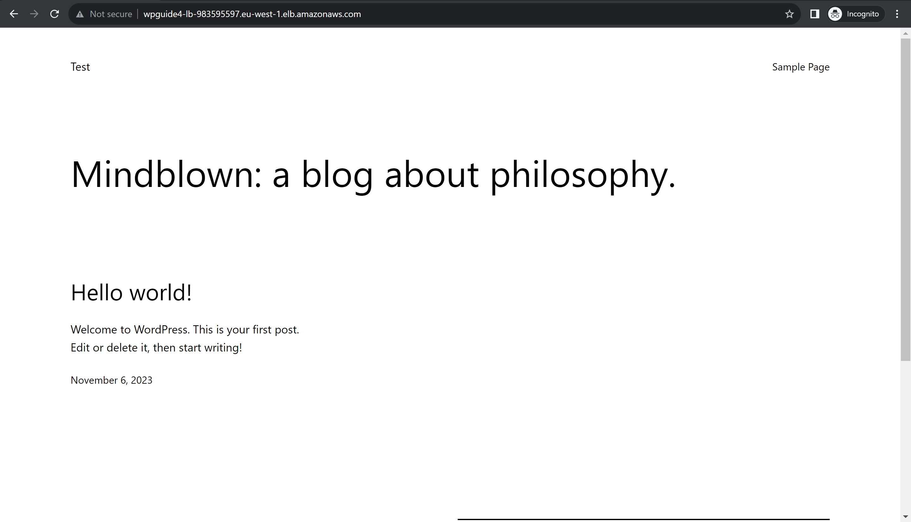
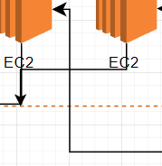

### Wordpress website with RDS MariaDB, Provisioning server, Application Load Balancer, Automatic Scaling Group and EFS.  
  
###### First up, I'll walk you through all the things we're about to setup.  

---


##### Alright, since i'm already a day late we'll get right into it.  
This is what we'll need to setup.
1. The MariaDB
    * Networking such as subnets, VPC, Sec groups etc.
    * Credentials
    * Allocated storage
    * AMI
1. The NFS hosted on EFS.
    * "Insert useful information here"
1. Launch Templates
    * Frontend EC2 Template.
    * Provisioning Template. (This will setup the WP configuration on EFS  
    file share which allows us to scale the setup.)
1. Network configuration
    * Subnet
    * VPC
    * Gateway
    * Route table
    * Route subnets to route table
    * Route gateway to route table
    * Security groups
1. An application load balancer
    * Target group
    * Listener
1. Auto scaling group
    * Dynamic scale policy

--- 
##### Code explaination  
First, some parameters. Here we can change some basic stuff. Note that password just laying about in a document like  
this is a big nono in production environments.
```yaml
AWSTemplateFormatVersion: "2010-09-09"
Parameters:
  DBInstanceClass:
    Default: db.t3.micro
    Description: DB instance class
    Type: String
    ConstraintDescription: Must select a valid DB instance type.
  DBAllocatedStorage:
    Default: '20'
    Description: The size of the database (GiB)
    Type: Number
    MinValue: '20'
    MaxValue: '20'
    ConstraintDescription: must be 20 GiB.
  DBUsername:
    Default: root
    NoEcho: 'true'
    Description: Username for MyMariaDb database access
    Type: String
    MinLength: '1'
    MaxLength: '16'
    AllowedPattern: '[a-zA-Z][a-zA-Z0-9]*'
    ConstraintDescription: must begin with a letter and contain only alphanumeric characters.
  DBPassword:
    Default: testing123
    NoEcho: 'true'
    Description: Password  MyMariaDb database access
    Type: String
    MinLength: '8'
    MaxLength: '41'
    AllowedPattern: '[a-zA-Z0-9]*'
    ConstraintDescription: must contain only alphanumeric characters.
```
---
#### Next up, the database itself.  
###### (I had completely forgot i named it jesus, but it's too late now)
"BackupRetentionPeriod: 0" disables backups. 
```yaml
Resources:

  MyMariaDB:
    Type: 'AWS::RDS::DBInstance'
    Properties:
      BackupRetentionPeriod: 0
      MultiAZ: true
      DBInstanceIdentifier:
        Fn::Sub: "${AWS::StackName}jesus1"
      DBName: wordpressDB
      DBInstanceClass: !Ref DBInstanceClass
      AllocatedStorage: !Ref DBAllocatedStorage
      Engine: mariadb
      MasterUsername: !Ref DBUsername
      MasterUserPassword: !Ref DBPassword
      PubliclyAccessible: true
      VPCSecurityGroups: 
        - !Ref mySecurityGroupDB
      DBSubnetGroupName: !Ref myDBSubnetGroup
    DependsOn: myGatewayAttach
```
---
#### Networking  
Hold on to your hat, this is a long one.
Basically.. Create VPC, Create Subnets, Create Gateway, Create Route table and then you mash it all together.
```yaml
  myVPC:
    Type: AWS::EC2::VPC
    Properties: 
      CidrBlock: '10.0.0.0/16'
      Tags: 
        - Key: Name
          Value:
            Fn::Sub: '${AWS::StackName}-myVPC'
      EnableDnsSupport: 'true'
      EnableDnsHostnames: 'true'

#Create subnet A
  mySubnetA:
    Type: AWS::EC2::Subnet
    Properties: 
      AvailabilityZone: !Select 
        - 0
        - Fn::GetAZs: !Ref AWS::Region
      VpcId: !Ref myVPC
      CidrBlock: '10.0.1.0/24'
      MapPublicIpOnLaunch: True

#Create subnet B
  mySubnetB:
    Type: AWS::EC2::Subnet
    Properties: 
      AvailabilityZone: !Select
        - 1
        - Fn::GetAZs: !Ref AWS::Region
      VpcId: !Ref myVPC
      CidrBlock: '10.0.2.0/24'
      MapPublicIpOnLaunch: True

#Create subnet C
  mySubnetC:
    Type: AWS::EC2::Subnet
    Properties: 
      AvailabilityZone: !Select 
        - 2
        - Fn::GetAZs: !Ref AWS::Region
      VpcId: !Ref myVPC
      CidrBlock: '10.0.3.0/24'
      MapPublicIpOnLaunch: True

#Create Gateway
  myInternetGateway:
    Type: AWS::EC2::InternetGateway
    Properties:
      Tags: 
        - Key: Name
          Value:
            Fn::Sub: '${AWS::StackName}-InternetGateway'
    DependsOn: myVPC
    
#Attaching gateway to virtual network
  myGatewayAttach:
    Type: AWS::EC2::VPCGatewayAttachment
    Properties: 
      InternetGatewayId:
        Ref: myInternetGateway
      VpcId:
        Ref: myVPC
    DependsOn: myInternetGateway

#Create route table
  myRouteTable:
    Type: AWS::EC2::RouteTable
    Properties:
      VpcId:  
        Ref: myVPC
      Tags:
        - Key: Name
          Value:
            Fn::Sub: '${AWS::StackName}-RTB'
    DependsOn: myGatewayAttach

#Routing network traffic from route table to gateway 
  myRoute:
    Type: AWS::EC2::Route
    Properties:
      GatewayId: !Ref myInternetGateway
      DestinationCidrBlock: 0.0.0.0/0
      RouteTableId: !Ref myRouteTable

#Create route from subnet A to route table
  mySubnetRouteTableAssociationA:
    Type: AWS::EC2::SubnetRouteTableAssociation
    Properties:
      SubnetId:
        Ref: mySubnetA
      RouteTableId:
        Ref: myRouteTable

#Create route from subnet B to route table
  mySubnetRouteTableAssociationB:
    Type: AWS::EC2::SubnetRouteTableAssociation
    Properties:
      SubnetId:
        Ref: mySubnetB
      RouteTableId:
        Ref: myRouteTable

#Create route from subnet C to route table
  mySubnetRouteTableAssociationC:
    Type: AWS::EC2::SubnetRouteTableAssociation
    Properties:
      SubnetId:
        Ref: mySubnetC
      RouteTableId:
        Ref: myRouteTable
```
And the security groups aswell
```yaml

  mySecurityGroup:
    Type: AWS::EC2::SecurityGroup
    Properties: 
      GroupDescription: "SecGroup for EFS"
      GroupName:
        Fn::Sub: '${AWS::StackName}-MyEFS-SecGroup'
      SecurityGroupIngress: 
        - IpProtocol: tcp
          FromPort: 2049
          ToPort: 2049
          CidrIp: 0.0.0.0/0
      Tags: 
        - Key: Name
          Value:
            Fn::Sub: '${AWS::StackName}-NFS'
      VpcId: !Ref myVPC

  mySecurityGroupDB:
    Type: AWS::EC2::SecurityGroup
    Properties: 
      GroupDescription: "SecGroup for DB"
      GroupName:
        Fn::Sub: '${AWS::StackName}-DB-SecGroup'
      SecurityGroupIngress: 
        - IpProtocol: tcp
          FromPort: 3306
          ToPort: 3306
          CidrIp: 0.0.0.0/0
      Tags: 
        - Key: Name
          Value:
            Fn::Sub: '${AWS::StackName}-DB-sec'
      VpcId: !Ref myVPC

  mySecurityGroupEC2:
    Type: AWS::EC2::SecurityGroup
    Properties: 
      GroupDescription: "SecGroup for EC2"
      GroupName:
        Fn::Sub: '${AWS::StackName}-EC2-SecGroup'
      SecurityGroupIngress: 
        - IpProtocol: tcp
          FromPort: 2049
          ToPort: 2049
          CidrIp: 0.0.0.0/0
        - IpProtocol: tcp
          FromPort: 80
          ToPort: 80
          CidrIp: 0.0.0.0/0
        - IpProtocol: tcp
          FromPort: 443
          ToPort: 443
          CidrIp: 0.0.0.0/0
        - IpProtocol: tcp
          FromPort: 22
          ToPort: 22
          CidrIp: 0.0.0.0/0
      Tags: 
        - Key: Name
          Value:
            Fn::Sub: '${AWS::StackName}-EC2'
      VpcId: !Ref myVPC
```

---
MyMariaDB uses the following to establish subnets.
```yaml
  myDBSubnetGroup:
    Type: "AWS::RDS::DBSubnetGroup"
    Properties:
      DBSubnetGroupDescription: "The DB Subnet group."
      SubnetIds:
       - !Ref mySubnetA
       - !Ref mySubnetB
       - !Ref mySubnetC
      Tags: 
        - 
          Key: Name
          Value:
            Fn::Sub: '${AWS::StackName}-myDBSubnetGroup'
```
Perfect, we'll do a quick recap of what's done so far.
- [x] 1. The MariaDB
    - [x] Networking such as subnets, VPC, Sec groups etc.
    - [x] Credentials
    - [x] Allocated storage
    - [x] AMI
- [ ] 2. The NFS hosted on EFS.
    - [ ] "Insert useful information here"
- [ ] 3. Launch Templates
    - [ ] Frontend EC2 Template.
    - [ ] Provisioning Template. (This will setup the WP configuration on EFS  
      file share which allows us to scale the setup.)
- [x] 4. Network configuration
    - [x] Subnet
    - [x] VPC
    - [x] Gateway
    - [x] Route table
    - [x] Route subnets to route table
    - [x] Route gateway to route table
    - [x] Security groups
- [ ] 5. An application load balancer
    - [ ] Target group
    - [ ] Listener
- [ ] 6. Auto scaling group
    - [ ] Dynamic scale policy

Hmm, the order of completion is a bit off.. eh, whatever we shall continue!
  
  Let's see.. AH yes! The NFS!

  ```yaml
    FileSystemResource:
    Type: AWS::EFS::FileSystem
    Properties:
      BackupPolicy:
        Status: DISABLED
      Encrypted: True
      FileSystemTags:
        - Key: Name
          Value: 
            Fn::Sub: '${AWS::StackName}-template'
      ThroughputMode: elastic
```
  And that's that.. well, almost. We need to set some mount target so that our  
  ec2 instances can actually mount to it.  
  Fairly simple, one for each subnet.
  ```yaml
    MountTargetResource1:
    Type: AWS::EFS::MountTarget
    Properties:
      FileSystemId: !Ref FileSystemResource
      SubnetId: !Ref mySubnetA
      SecurityGroups:
      - !Ref mySecurityGroup

  MountTargetResource2:
    Type: AWS::EFS::MountTarget
    Properties:
      FileSystemId: !Ref FileSystemResource
      SubnetId: !Ref mySubnetB
      SecurityGroups:
      - !Ref mySecurityGroup

  MountTargetResource3:
    Type: AWS::EFS::MountTarget
    Properties:
      FileSystemId: !Ref FileSystemResource
      SubnetId: !Ref mySubnetC
      SecurityGroups:
      - !Ref mySecurityGroup
```

---
Two ec2 templates. One is for the "Frontend" and the second one is for  
the provisioning server, basically the one that will configure wordpress.  
  
  First up, the "Frontend"
```yaml
  myLaunchTemplate:
    Type: AWS::EC2::LaunchTemplate
    Properties:
      LaunchTemplateName:
        Fn::Sub: '${AWS::StackName}-testing'
      LaunchTemplateData:
        ImageId: 'ami-0b9fd8b55a6e3c9d5'
        InstanceType: "t2.micro"
        SecurityGroupIds: 
          - !Ref mySecurityGroupEC2
        KeyName: labb1
        UserData: 
          Fn::Base64: !Sub |
            #!/bin/bash
            dnf update -y
            dnf install amazon-efs-utils -y
            dnf install -y httpd wget php-fpm php-mysqli php-json php php-devel
            systemctl start httpd
            systemctl is-enabled httpd
            systemctl restart php-fpm
            systemctl restart httpd
            mount -t efs -o tls '${FileSystemResource}':/ var/www
    DependsOn: 
      - MountTargetResource1
      - MountTargetResource2
      - MountTargetResource3
```
Let's look at the UserData section here for a second.  
So what we're doing is installing apache and other requirements
to host the wordpress website.  
Then we mount it to the EFS. Since we put the mount in "var/www".  
We'll now have access to an already configured directory.  
AKA the directory our provisioning server has configured.
This allows us to scale the "frontend".
Another key point is that this EC2 will be static, and the only 
dynamic data is actually on a seperate location, the NFS.  

---
Now to the Provisioning template.
```yaml
  myLaunchTemplateProv:
    Type: AWS::EC2::LaunchTemplate
    Properties:
      LaunchTemplateName:
        Fn::Sub: '${AWS::StackName}-Prov'
      LaunchTemplateData:
        ImageId: 'ami-0b9fd8b55a6e3c9d5'
        InstanceType: "t2.micro"
        SecurityGroupIds: 
          - !Ref mySecurityGroupEC2
        KeyName: labb1
        UserData: 
          Fn::Base64: 
            Fn::Sub: |
              #!/bin/bash -ex
              yum update -y
              yum install amazon-efs-utils -y
              mkdir -p /var/www
              mount -t efs -o tls ${FileSystemResource}:/ /var/www
              yum install -y httpd wget php-fpm php-mysqli php-json php php-devel
              systemctl start httpd
              systemctl enable httpd
              chown -R ec2-user:apache /var/www
              chmod 2775 /var/www && find /var/www -type d -exec sudo chmod 2775 {} \;
              find /var/www -type f -exec sudo chmod 0664 {} \;
              yum install -y mariadb105
              wget -P /home/ec2-user/ https://wordpress.org/latest.tar.gz
              tar -xzf /home/ec2-user/latest.tar.gz -C /home/ec2-user/
              cp /home/ec2-user/wordpress/wp-config-sample.php /home/ec2-user/wordpress/wp-config.php
              sed -i 's/username_here/root/' /home/ec2-user/wordpress/wp-config.php
              sed -i 's/password_here/testing123/' /home/ec2-user/wordpress/wp-config.php
              sed -i 's/database_name_here/wordpressDB/' /home/ec2-user/wordpress/wp-config.php
              sed -i "s/localhost/${MyMariaDB.Endpoint.Address}/" /home/ec2-user/wordpress/wp-config.php
              cp -r /home/ec2-user/wordpress/* /var/www/html/
              service httpd restart
              shutdown
```
This took a while to grasp. But once you understand what's happening it's actually pretty simple.
I'm not diving in the deep end of the pool here, oversimplified explaination incoming.
It configures wordpress, and moves it to the "/var/www" which is mounted. 
Actuall location is on the EFS, making is accessable to all ec2 we're creating.  
  
  Yeah, that's condensed but it is actually what's happening.

---

Next up we want to start an provisioning EC2 from the template to let it do its thing.
Not here that we have "InstanceInitiatedShutdownBehavior: terminate"
The last line of our script up above is "Shutdown".  
So when you run the stack, it'll pop up, run the configuration script, then it'll shutdown and terminate.


```yaml 
  myEC2InstanceProv:
    Type: AWS::EC2::Instance
    Properties:
      LaunchTemplate:
        LaunchTemplateId: !Ref myLaunchTemplateProv
        Version: 1
      SubnetId: !Ref mySubnetA
      InstanceInitiatedShutdownBehavior: terminate
      Tags:
        - Key: Name
          Value:
            Fn::Sub: '${AWS::StackName}-EC2-prov'
    DependsOn: 
      - MountTargetResource1
      - MountTargetResource2
      - MountTargetResource3
```

---

Recap time  
  

  - [x] 1. The MariaDB
    - [x] Networking such as subnets, VPC, Sec groups etc.
    - [x] Credentials
    - [x] Allocated storage
    - [x] AMI
- [x] 2. The NFS hosted on EFS.
    - [x] "Insert useful information here"
- [x] 3. Launch Templates
    - [x] Frontend EC2 Template.
    - [x] Provisioning Template. (This will setup the WP configuration on EFS  
      file share which allows us to scale the setup.)
- [x] 4. Network configuration
    - [x] Subnet
    - [x] VPC
    - [x] Gateway
    - [x] Route table
    - [x] Route subnets to route table
    - [x] Route gateway to route table
    - [x] Security groups
- [ ] 5. An application load balancer
    - [ ] Target group
    - [ ] Listener
- [ ] 6. Auto scaling group
    - [ ] Dynamic scale policy

Okay, looks good so far.  

---

The Application Load Balancer.

```yaml
#Create application load balancer
  myLoadBalancer:
    Type: AWS::ElasticLoadBalancingV2::LoadBalancer
    Properties:
      Name: 
        Fn::Sub: '${AWS::StackName}-LB'
      SecurityGroups:
        - !Ref mySecurityGroupLB
      Type: application
      Subnets: 
        - !Ref mySubnetA
        - !Ref mySubnetB
        - !Ref mySubnetC
    DependsOn: myGatewayAttach
```
The Target Group

```yaml
#Create target group
  myTargetGroup:
    Type: AWS::ElasticLoadBalancingV2::TargetGroup
    Properties:
      HealthCheckEnabled: True
      Name:
        Fn::Sub: '${AWS::StackName}-TG'
      Port: 80
      Protocol: HTTP
      VpcId: !Ref myVPC
```

The Listener

```yaml
#Create listener
  myListener:
    Type: AWS::ElasticLoadBalancingV2::Listener
    Properties:
      DefaultActions:
        - Type: "forward"
          TargetGroupArn: !Ref myTargetGroup
      LoadBalancerArn: !Ref myLoadBalancer
      Port: 80
      Protocol: "HTTP"
```

Followed by the Automatic Scaling group  
With 2 minimum machines and 5 max.

```yaml
#Create auto scaling group
  myAutoScalingGroup:
    Type: AWS::AutoScaling::AutoScalingGroup
    Properties:
      TargetGroupARNs: 
        - !Ref myTargetGroup
      LaunchTemplate:
        LaunchTemplateId: !Ref myLaunchTemplate
        Version: !GetAtt myLaunchTemplate.LatestVersionNumber
      MaxSize: '5'
      MinSize: '2'
      DesiredCapacity: '2'
      VPCZoneIdentifier:
       - !Ref mySubnetA
       - !Ref mySubnetB
       - !Ref mySubnetC
    DependsOn: myGatewayAttach
```

And the Scaling policy.  
In this case we'll scale up if cpu usage goes over 70% spread between all instances.  

```yaml
#Create automatic/dynamic scaling policy. 
  myCPUPolicy:
    Type: AWS::AutoScaling::ScalingPolicy
    Properties:
      AutoScalingGroupName: !Ref myAutoScalingGroup
      PolicyType: TargetTrackingScaling
      TargetTrackingConfiguration:
        PredefinedMetricSpecification:
          PredefinedMetricType: ASGAverageCPUUtilization
        TargetValue: "70" 
```
And the grand finale, some useful outputs.

```yaml
Outputs:

  TestSite:
    Description: Load balancer DNS (Aka where the site is hosted.)
    Value:
      Fn::Sub: 'http://${myLoadBalancer.DNSName}' 

  SystemIdTest:
    Description: testing SystemIdTest
    Value: 
      Fn::Sub: '${FileSystemResource}'

  MyMariaDbAddress:
    Description: "The address of mariadb"
    Value:
      Fn::Sub: '${MyMariaDB.Endpoint.Address}'
```

--

Another check list!
  - [x] 1. The MariaDB
    - [x] Networking such as subnets, VPC, Sec groups etc.
    - [x] Credentials
    - [x] Allocated storage
    - [x] AMI
- [x] 2. The NFS hosted on EFS.
    - [x] "Insert useful information here"
- [x] 3. Launch Templates
    - [x] Frontend EC2 Template.
    - [x] Provisioning Template. (This will setup the WP configuration on EFS  
      file share which allows us to scale the setup.)
- [x] 4. Network configuration
    - [x] Subnet
    - [x] VPC
    - [x] Gateway
    - [x] Route table
    - [x] Route subnets to route table
    - [x] Route gateway to route table
    - [x] Security groups
- [x] 5. An application load balancer
    - [x] Target group
    - [x] Listener
- [x] 6. Auto scaling group
    - [x] Dynamic scale policy

---

Perfect, now let's check is this all has worked.  
I'll show you how you can check if it works.

---
Run the stack  
Fair warning, this'll take approximately 7 lifetimes.
Be patient. Go for a walk across the entire globe, you'll be back in time.




And one eternity later, bam



Alright, let's check on the EC2 instances.  
Note that the provisioning instance is shutting down. Means it's done.



Now we can check the outputs of the stack and click "TestSite"



This lil guy



And with alot of patience, this'll show up!



Just fill in your information and click install WordPress

BEAUTIFUL


Sorry for the delay by the way.

Anyway, with everything done i'll post the entire yaml below


```yaml 
AWSTemplateFormatVersion: "2010-09-09"
Parameters:
  DBInstanceClass:
    Default: db.t3.micro
    Description: DB instance class
    Type: String
    ConstraintDescription: Must select a valid DB instance type.
  DBAllocatedStorage:
    Default: '20'
    Description: The size of the database (GiB)
    Type: Number
    MinValue: '20'
    MaxValue: '20'
    ConstraintDescription: must be 20 GiB.
  DBUsername:
    Default: root
    NoEcho: 'true'
    Description: Username for MyMariaDb database access
    Type: String
    MinLength: '1'
    MaxLength: '16'
    AllowedPattern: '[a-zA-Z][a-zA-Z0-9]*'
    ConstraintDescription: must begin with a letter and contain only alphanumeric characters.
  DBPassword:
    Default: testing123
    NoEcho: 'true'
    Description: Password  MyMariaDb database access
    Type: String
    MinLength: '8'
    MaxLength: '41'
    AllowedPattern: '[a-zA-Z0-9]*'
    ConstraintDescription: must contain only alphanumeric characters.
Resources:

  MyMariaDB:
    Type: 'AWS::RDS::DBInstance'
    Properties:
      BackupRetentionPeriod: 0
      MultiAZ: true
      DBInstanceIdentifier:
        Fn::Sub: "${AWS::StackName}jesus1"
      DBName: wordpressDB
      DBInstanceClass: !Ref DBInstanceClass
      AllocatedStorage: !Ref DBAllocatedStorage
      Engine: mariadb
      MasterUsername: !Ref DBUsername
      MasterUserPassword: !Ref DBPassword
      PubliclyAccessible: true
      VPCSecurityGroups: 
        - !Ref mySecurityGroupDB
      DBSubnetGroupName: !Ref myDBSubnetGroup
    DependsOn: myGatewayAttach

  myVPC:
    Type: AWS::EC2::VPC
    Properties: 
      CidrBlock: '10.0.0.0/16'
      Tags: 
        - Key: Name
          Value:
            Fn::Sub: '${AWS::StackName}-myVPC'
      EnableDnsSupport: 'true'
      EnableDnsHostnames: 'true'

#Create subnet A
  mySubnetA:
    Type: AWS::EC2::Subnet
    Properties: 
      AvailabilityZone: !Select 
        - 0
        - Fn::GetAZs: !Ref AWS::Region
      VpcId: !Ref myVPC
      CidrBlock: '10.0.1.0/24'
      MapPublicIpOnLaunch: True

#Create subnet B
  mySubnetB:
    Type: AWS::EC2::Subnet
    Properties: 
      AvailabilityZone: !Select
        - 1
        - Fn::GetAZs: !Ref AWS::Region
      VpcId: !Ref myVPC
      CidrBlock: '10.0.2.0/24'
      MapPublicIpOnLaunch: True

#Create subnet C
  mySubnetC:
    Type: AWS::EC2::Subnet
    Properties: 
      AvailabilityZone: !Select 
        - 2
        - Fn::GetAZs: !Ref AWS::Region
      VpcId: !Ref myVPC
      CidrBlock: '10.0.3.0/24'
      MapPublicIpOnLaunch: True

#Create Gateway
  myInternetGateway:
    Type: AWS::EC2::InternetGateway
    Properties:
      Tags: 
        - Key: Name
          Value:
            Fn::Sub: '${AWS::StackName}-InternetGateway'
    DependsOn: myVPC
    
#Attaching gateway to virtual network
  myGatewayAttach:
    Type: AWS::EC2::VPCGatewayAttachment
    Properties: 
      InternetGatewayId:
        Ref: myInternetGateway
      VpcId:
        Ref: myVPC
    DependsOn: myInternetGateway

#Create route table
  myRouteTable:
    Type: AWS::EC2::RouteTable
    Properties:
      VpcId:  
        Ref: myVPC
      Tags:
        - Key: Name
          Value:
            Fn::Sub: '${AWS::StackName}-RTB'
    DependsOn: myGatewayAttach

#Routing network traffic from route table to gateway 
  myRoute:
    Type: AWS::EC2::Route
    Properties:
      GatewayId: !Ref myInternetGateway
      DestinationCidrBlock: 0.0.0.0/0
      RouteTableId: !Ref myRouteTable

#Create route from subnet A to route table
  mySubnetRouteTableAssociationA:
    Type: AWS::EC2::SubnetRouteTableAssociation
    Properties:
      SubnetId:
        Ref: mySubnetA
      RouteTableId:
        Ref: myRouteTable

#Create route from subnet B to route table
  mySubnetRouteTableAssociationB:
    Type: AWS::EC2::SubnetRouteTableAssociation
    Properties:
      SubnetId:
        Ref: mySubnetB
      RouteTableId:
        Ref: myRouteTable

#Create route from subnet C to route table
  mySubnetRouteTableAssociationC:
    Type: AWS::EC2::SubnetRouteTableAssociation
    Properties:
      SubnetId:
        Ref: mySubnetC
      RouteTableId:
        Ref: myRouteTable

  myDBSubnetGroup:
    Type: "AWS::RDS::DBSubnetGroup"
    Properties:
      DBSubnetGroupDescription: "The DB Subnet group."
      SubnetIds:
       - !Ref mySubnetA
       - !Ref mySubnetB
       - !Ref mySubnetC
      Tags: 
        - 
          Key: Name
          Value:
            Fn::Sub: '${AWS::StackName}-myDBSubnetGroup'

  mySecurityGroup:
    Type: AWS::EC2::SecurityGroup
    Properties: 
      GroupDescription: "SecGroup for EFS"
      GroupName:
        Fn::Sub: '${AWS::StackName}-MyEFS-SecGroup'
      SecurityGroupIngress: 
        - IpProtocol: tcp
          FromPort: 2049
          ToPort: 2049
          CidrIp: 0.0.0.0/0
      Tags: 
        - Key: Name
          Value:
            Fn::Sub: '${AWS::StackName}-NFS'
      VpcId: !Ref myVPC

  mySecurityGroupDB:
    Type: AWS::EC2::SecurityGroup
    Properties: 
      GroupDescription: "SecGroup for DB"
      GroupName:
        Fn::Sub: '${AWS::StackName}-DB-SecGroup'
      SecurityGroupIngress: 
        - IpProtocol: tcp
          FromPort: 3306
          ToPort: 3306
          CidrIp: 0.0.0.0/0
      Tags: 
        - Key: Name
          Value:
            Fn::Sub: '${AWS::StackName}-DB-sec'
      VpcId: !Ref myVPC

  mySecurityGroupEC2:
    Type: AWS::EC2::SecurityGroup
    Properties: 
      GroupDescription: "SecGroup for EC2"
      GroupName:
        Fn::Sub: '${AWS::StackName}-EC2-SecGroup'
      SecurityGroupIngress: 
        - IpProtocol: tcp
          FromPort: 2049
          ToPort: 2049
          CidrIp: 0.0.0.0/0
        - IpProtocol: tcp
          FromPort: 80
          ToPort: 80
          CidrIp: 0.0.0.0/0
        - IpProtocol: tcp
          FromPort: 443
          ToPort: 443
          CidrIp: 0.0.0.0/0
        - IpProtocol: tcp
          FromPort: 22
          ToPort: 22
          CidrIp: 0.0.0.0/0
      Tags: 
        - Key: Name
          Value:
            Fn::Sub: '${AWS::StackName}-EC2'
      VpcId: !Ref myVPC

  FileSystemResource:
    Type: AWS::EFS::FileSystem
    Properties:
      BackupPolicy:
        Status: DISABLED
      Encrypted: True
      FileSystemTags:
        - Key: Name
          Value: 
            Fn::Sub: '${AWS::StackName}-template'
      ThroughputMode: elastic


  MountTargetResource1:
    Type: AWS::EFS::MountTarget
    Properties:
      FileSystemId: !Ref FileSystemResource
      SubnetId: !Ref mySubnetA
      SecurityGroups:
      - !Ref mySecurityGroup

  MountTargetResource2:
    Type: AWS::EFS::MountTarget
    Properties:
      FileSystemId: !Ref FileSystemResource
      SubnetId: !Ref mySubnetB
      SecurityGroups:
      - !Ref mySecurityGroup

  MountTargetResource3:
    Type: AWS::EFS::MountTarget
    Properties:
      FileSystemId: !Ref FileSystemResource
      SubnetId: !Ref mySubnetC
      SecurityGroups:
      - !Ref mySecurityGroup


  mySecurityGroupLB:
    Type: AWS::EC2::SecurityGroup
    Properties: 
      GroupDescription: "SecGroup for EFS"
      GroupName:
        Fn::Sub: '${AWS::StackName}-LB-Sec'
      SecurityGroupIngress: 
        - IpProtocol: tcp
          FromPort: 80
          ToPort: 80
          CidrIp: 0.0.0.0/0
      Tags: 
        - Key: Name
          Value:
            Fn::Sub: '${AWS::StackName}-NFS'
      VpcId: !Ref myVPC


#Create application load balancer
  myLoadBalancer:
    Type: AWS::ElasticLoadBalancingV2::LoadBalancer
    Properties:
      Name: 
        Fn::Sub: '${AWS::StackName}-LB'
      SecurityGroups:
        - !Ref mySecurityGroupLB
      Type: application
      Subnets: 
        - !Ref mySubnetA
        - !Ref mySubnetB
        - !Ref mySubnetC
    DependsOn: myGatewayAttach

#Create target group
  myTargetGroup:
    Type: AWS::ElasticLoadBalancingV2::TargetGroup
    Properties:
      HealthCheckEnabled: True
      Name:
        Fn::Sub: '${AWS::StackName}-TG'
      Port: 80
      Protocol: HTTP
      VpcId: !Ref myVPC
#Create listener
  myListener:
    Type: AWS::ElasticLoadBalancingV2::Listener
    Properties:
      DefaultActions:
        - Type: "forward"
          TargetGroupArn: !Ref myTargetGroup
      LoadBalancerArn: !Ref myLoadBalancer
      Port: 80
      Protocol: "HTTP"
#Create auto scaling group
  myAutoScalingGroup:
    Type: AWS::AutoScaling::AutoScalingGroup
    Properties:
      TargetGroupARNs: 
        - !Ref myTargetGroup
      LaunchTemplate:
        LaunchTemplateId: !Ref myLaunchTemplate
        Version: !GetAtt myLaunchTemplate.LatestVersionNumber
      MaxSize: '5'
      MinSize: '2'
      DesiredCapacity: '2'
      VPCZoneIdentifier:
       - !Ref mySubnetA
       - !Ref mySubnetB
       - !Ref mySubnetC
    DependsOn: myGatewayAttach
#Create automatic/dynamic scaling policy. 
  myCPUPolicy:
    Type: AWS::AutoScaling::ScalingPolicy
    Properties:
      AutoScalingGroupName: !Ref myAutoScalingGroup
      PolicyType: TargetTrackingScaling
      TargetTrackingConfiguration:
        PredefinedMetricSpecification:
          PredefinedMetricType: ASGAverageCPUUtilization
        TargetValue: "70"


  myLaunchTemplate:
    Type: AWS::EC2::LaunchTemplate
    Properties:
      LaunchTemplateName:
        Fn::Sub: '${AWS::StackName}-testing'
      LaunchTemplateData:
        ImageId: 'ami-0b9fd8b55a6e3c9d5'
        InstanceType: "t2.micro"
        SecurityGroupIds: 
          - !Ref mySecurityGroupEC2
        KeyName: labb1
        UserData: 
          Fn::Base64: !Sub |
            #!/bin/bash
            dnf update -y
            dnf install amazon-efs-utils -y
            dnf install -y httpd wget php-fpm php-mysqli php-json php php-devel
            systemctl start httpd
            systemctl is-enabled httpd
            systemctl restart php-fpm
            systemctl restart httpd
            mount -t efs -o tls '${FileSystemResource}':/ var/www
    DependsOn: 
      - MountTargetResource1
      - MountTargetResource2
      - MountTargetResource3

  myLaunchTemplateProv:
    Type: AWS::EC2::LaunchTemplate
    Properties:
      LaunchTemplateName:
        Fn::Sub: '${AWS::StackName}-Prov'
      LaunchTemplateData:
        ImageId: 'ami-0b9fd8b55a6e3c9d5'
        InstanceType: "t2.micro"
        SecurityGroupIds: 
          - !Ref mySecurityGroupEC2
        KeyName: labb1
        UserData: 
          Fn::Base64: 
            Fn::Sub: |
              #!/bin/bash -ex
              yum update -y
              yum install amazon-efs-utils -y
              mkdir -p /var/www
              mount -t efs -o tls ${FileSystemResource}:/ /var/www
              yum install -y httpd wget php-fpm php-mysqli php-json php php-devel
              systemctl start httpd
              systemctl enable httpd
              chown -R ec2-user:apache /var/www
              chmod 2775 /var/www && find /var/www -type d -exec sudo chmod 2775 {} \;
              find /var/www -type f -exec sudo chmod 0664 {} \;
              yum install -y mariadb105
              wget -P /home/ec2-user/ https://wordpress.org/latest.tar.gz
              tar -xzf /home/ec2-user/latest.tar.gz -C /home/ec2-user/
              cp /home/ec2-user/wordpress/wp-config-sample.php /home/ec2-user/wordpress/wp-config.php
              sed -i 's/username_here/root/' /home/ec2-user/wordpress/wp-config.php
              sed -i 's/password_here/testing123/' /home/ec2-user/wordpress/wp-config.php
              sed -i 's/database_name_here/wordpressDB/' /home/ec2-user/wordpress/wp-config.php
              sed -i "s/localhost/${MyMariaDB.Endpoint.Address}/" /home/ec2-user/wordpress/wp-config.php
              cp -r /home/ec2-user/wordpress/* /var/www/html/
              service httpd restart
              shutdown

  myEC2InstanceProv:
    Type: AWS::EC2::Instance
    Properties:
      LaunchTemplate:
        LaunchTemplateId: !Ref myLaunchTemplateProv
        Version: 1
      SubnetId: !Ref mySubnetA
      InstanceInitiatedShutdownBehavior: terminate
      Tags:
        - Key: Name
          Value:
            Fn::Sub: '${AWS::StackName}-EC2-prov'
    DependsOn: 
      - MountTargetResource1
      - MountTargetResource2
      - MountTargetResource3
Outputs:

  TestSite:
    Description: Load balancer DNS (Aka where the site is hosted.)
    Value:
      Fn::Sub: 'http://${myLoadBalancer.DNSName}' 

  SystemIdTest:
    Description: testing SystemIdTest
    Value: 
      Fn::Sub: '${FileSystemResource}'

  MyMariaDbAddress:
    Description: "The address of mariadb"
    Value:
      Fn::Sub: '${MyMariaDB.Endpoint.Address}'
```
Chaotic IaC by Felix Petersson.
Mov2022 

---

Also, when drawing the structure picture, misshapps can happen. Like this one.



DISCLAIMER I DO NO AGREE with a  
certain ideologi from the 30's - 40s  

But I did get a good giggle out of that.